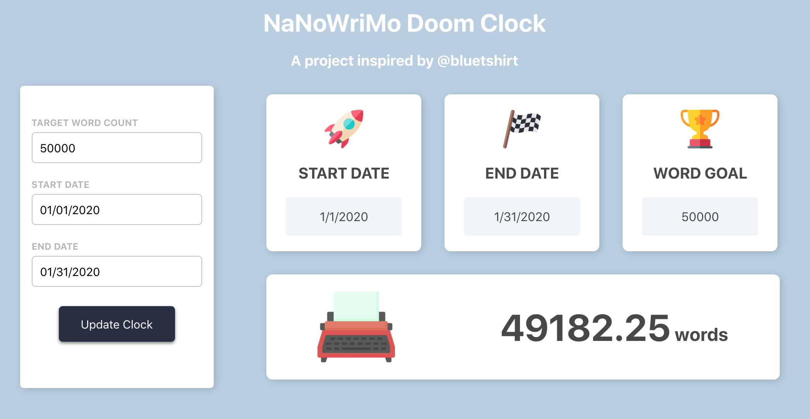

# NaNoWriMo Doom Clock
## Summary 
This is a web application designed to be used for timed writing challenges in the style of NaNoWriMo. Users can pick a word count goal, as well as a start and end date of their challenge, and see on the clock how many words they should have—at that very second. 

## Languages
This project was created with React.js. For styling, CSS and Flexbox were used. The npm package react-datepicker was used for the date selection input fields. 
## Graphics
The graphics used within this web app were pulled from flaticon.com 
